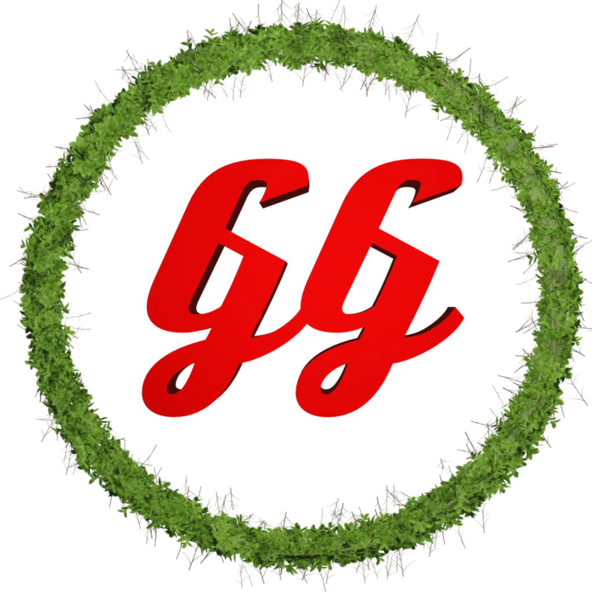

  
  <h1 style="font-size: 2.5rem; margin-top: 0.5rem;">GardenGate</h1>

Experimental private servers for Plants vs. Zombies Garden Warfare 1,2 & Battle for Neighborville

  
  

## Roadmap
### What's done:
* Offsets
* Hosting servers
* Joining
* Unlockers that unlock everything

### What's not done (TODO):
* Player kicking/moderation
* Bot support for gw1
* Make it so that only host can load into levels
* [Closing a client](./Assets/client.webp) through the console instead of the game tricks the server into believing you are still connected, so attempting to load into another level causes the entire server to softlock
* Fix Zombopolis last, several doorways in the center area are blocked for clients. Host and bots can pass through, but clients and their objects (e.g. bean bombs) cannot.
* Fix Zomburbia Zombot fuses on last point unable to be broken

## Directory structure
| Directory | Description                 |
|-----------|-----------------------------|
| `Assets` | Related assets               |
| `Container` | Container files           |
| `DLL` | DLL injected to the game client |
| `Docs` | Documentation                  |
| `Launcher` | Launcher application       |
| `Mods` | QoL mods                       |

## Credits

- RaT

- nocss

- twig

- blueballoon

- eshaydev

- gargos69junior

- werzdragon

- puro420

### Third-Party
Following open-source projects were used:

- [MinHook](https://github.com/TsudaKageyu/minhook)
- [Kyber](https://github.com/ArmchairDevelopers/Kyber)
