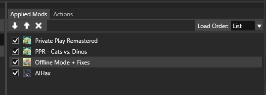

# Joining

1. Download the archive from [releases](https://github.com/nocss42/GardenGate/releases) 

2. Install the following mods for best experience

### Garden warfare 1
[UnlockAll](../Mods/gw1/UnlockAll.fbmod)

## If you own bfn on EA App and you want to switch back to official servers, instead of the revert button on the launcher use the repair button on the EA App itself and remove `dinput8.dll` from game directory. (we're looking into this)

### Garden warfare 2/Battle for Neighborville
[GardenGate.fbpack](../Mods/gw2/GardenGate.fbpack)

Import the FBPack in Frosty Mod Manager (Skip this step for bfn), the load order should be something like this;

3. Open up the launcher go to patcher and press auto detect > patch and then press launch

### Mod Credits
Private Play (Dark Damona,brekko)

Private Play Extension (Dark Damona,brekko)

Offline mode + Fixes (brekko, modified)

AIHax (Nam)

Anti-AFK Kick (Virjoinga)

Return to backyard fix (Gigus Chadus)
